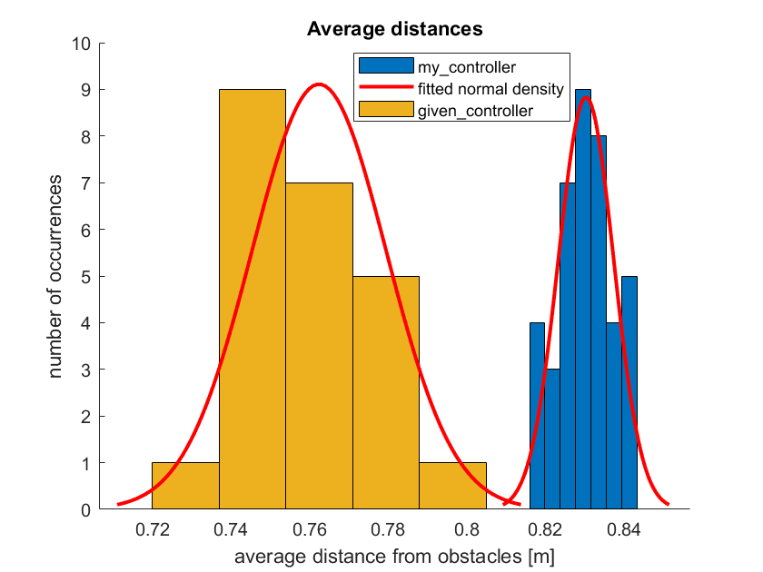
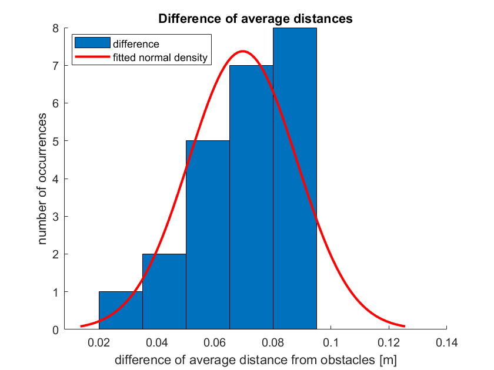
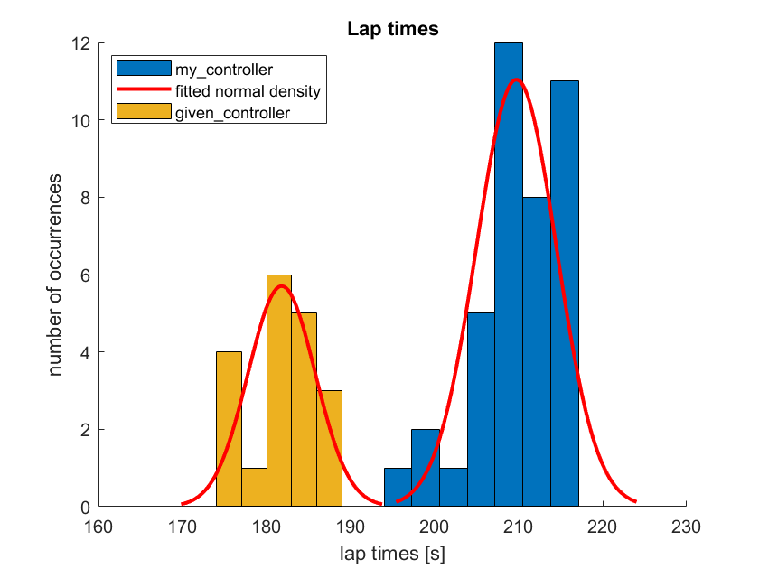
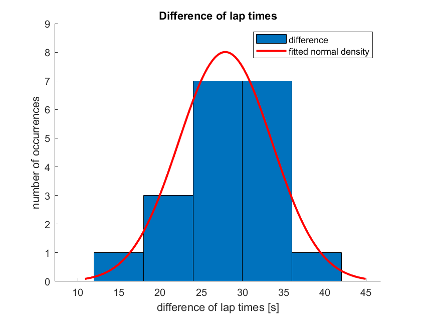
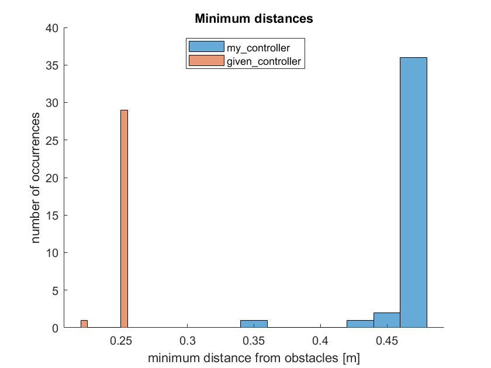
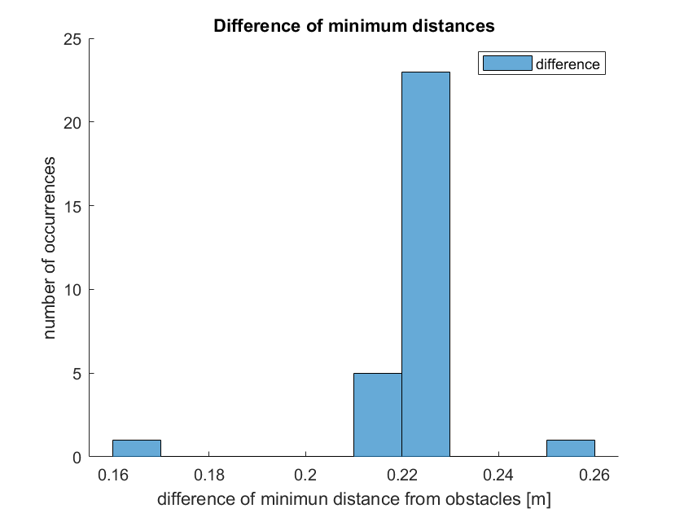
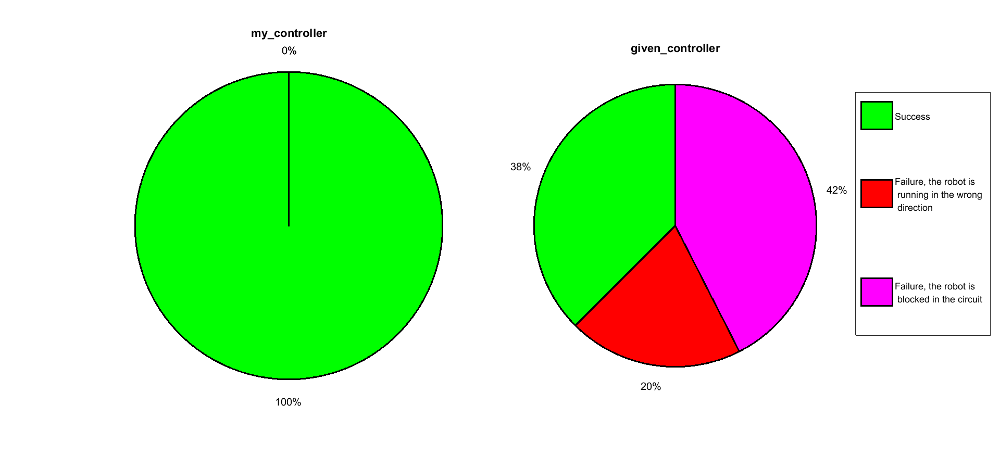

Statistical Analysis comparing two autonomous robots
====================================================

Statistical analysis of the [first assignment of research track 1 course](https://github.com/ettore9x9/RT1_assignment1.git), considering two different implementations of the robot controller.

The goal of this assignment is to find out which one of the two implementations performs better in terms of:
* Average time to complete one lap.
* Overall minimum distance from obstacles.
* Average distance from obstacles.
* Percentage of failures, e. g., robot crashes, going in the wrong directions, blocked in the circuit.

The two implementations are:
* `my_controller.py`
* `given_controller.py`

You can run them separately with:
```bash
$ python2 run.py my_controller.py
```
```bash
$ python2 run.py given_controller.py
```

Data collection
---------------

The bash file `run.sh` performs the data collection autonomously, without user action.

You can run the data collection (it takes about 18h) simply with:
```bash
$ ./run.sh
```
In detail, it runs the robot implementations 40 times each, for three laps each run. Every couple of tests, this script changes the arena. Every arena has a different location of silver tokens.

All the 40 arenas are stored in the folder `./sr/robot/arenas/arenas_for_statistical_analysis`, the first arena is the default one.

All the code needed to extract data from every run is in the python script `funcAnalysis.py`; in particular:
* The `timer` class takes care of keeping the time of each lap.
* The `analyzer` class records the minimum distance from obstacles, detects the end of the lap, and reports failures.

The folder `data_collection` stores all data extracted. If you need a more verbose output, you can look at the file `analysis.log`: which reports all the steps performed by the `run.sh`.

Moreover, the robot fails if it comes back in the wrong direction or remains blocked in the circuit. In these cases, measures may be distorted, so it is better to discard them. In particular:
* If the robot is blocked in the circuit, the average distance is false.
* If the robot performs only one lap, the average time of a lap is false.

In this situation, the data are discarded because deemed corrupted.

Statistical analysis
--------------------

### Average distance from obstacles ###

Robots' average distances from obstacles, for different arenas. Each histogram's column represents the number of times the average distance from obstacles falls into that interval, distinguishing between the two implementations.

<p align="center">

</p>

If we make the difference for each test's instance, we will obtain the following distribution.

<p align="center">

</p>

To test if the differences in distances follow a normal distribution, we can use the **Shapiro-Wilk test**, made for a small number of data.

>Null hypothesis: *the differences in the average distances follow a normal distribution*
>
>Results: 
>+ *H = 0* 
>+ *p = 0.210160*
>
>We failed to reject the null hypothesis.

So, it is reasonable to treat them as data belonging to a population with a normal distribution.

To test if the two samples belong to the same population, we can use the **paired ttest**. Indeed, the two assumptions are satisfied:
* The differences between the two observations follow a normal distribution. 
* The test compares two different controllers applied to the same scenario.

>Null hypothesis: *the two samples of average distances are drawn from the same population*
>
>Results: 
>+ *H = 1* 
>+ *p = 0.00*
>
>We can reject the null hypothesis.

### Average time of a lap ###

Robots' average time of a lap for different arenas. We notice that *my_controller* has some samples more than *given_controller*: this because the second one has a higher chance of failure.

<p align="center">

</p>

If we make the difference between the previous results, we obtain the following distribution. We considered only coupled data.

<p align="center">

</p>

Once again, to test if the differences between the lap times follow a normal distribution, we can use the **Shapiro-Wilk test**.

>Null hypothesis: *the differences in the lap times follow a normal distribution*
>
>Results: 
>+ *H = 0* 
>+ *p = 0.669946*
>
>We failed to reject the null hypothesis.

To test if the two samples belong to the same population, we can use the **paired ttest**. Indeed, the two assumptions are satisfied:
* The differences between the two observations follow a normal distribution. 
* The test compares two different controllers applied to the same scenario.

>Null hypothesis: *the two samples of lap times are drawn from the same population*
>
>Results: 
>+ *H = 1* 
>+ *p = 0.00*
>
>We can reject the null hypothesis.

### Minimum distance from obstacles ###

Robots' minimum distance from obstacles in each arena.

<p align="center">

</p>

Considering the difference between the previous results, we obtain the following distribution.

<p align="center">

</p>

To test if the differences between the lap times follow a normal distribution, we can use the **Shapiro-Wilk test** again.

>Null hypothesis: *the differences of the minimum distances follow a normal distribution*
>
>Results: 
>+ *H = 1* 
>+ *p = 0.00*
>
>We can reject the null hypothesis.

In this case, we can not use the ttest as before: we need a non-parametric test because the difference between the two samples does not follow a normal distribution.

To test if the two samples belong to the same population, we can use the **U test**.

>Null hypothesis: *the two samples of minimum distances are drawn from the same population*
>
>Results: 
>+ *H = 1* 
>+ *p = 0.00*
>
>We can reject the null hypothesis.

Again, in this last case, the two samples do not belong to the same population.

### Percentage of success/failures ###

This is the percentage of the robot failure driven by the two controllers in different arenas.

<p align="center">

</p>

Conclusions
-----------

With the results of the performed tests, we can infer that all results belong to different populations, so:
* *my_controller* keeps more distance from obstacles on average.
* *given_controller* takes less time on average to complete one lap.
* The minimum distance from the obstacle of *my_controller* is greater than *given_controller*.

Moreover, *my_controller* never failed in the tests performed. Instead, *given_controller* succeeded in only 38% of the trials.
